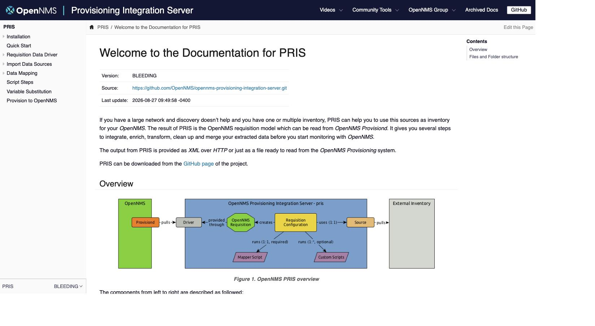
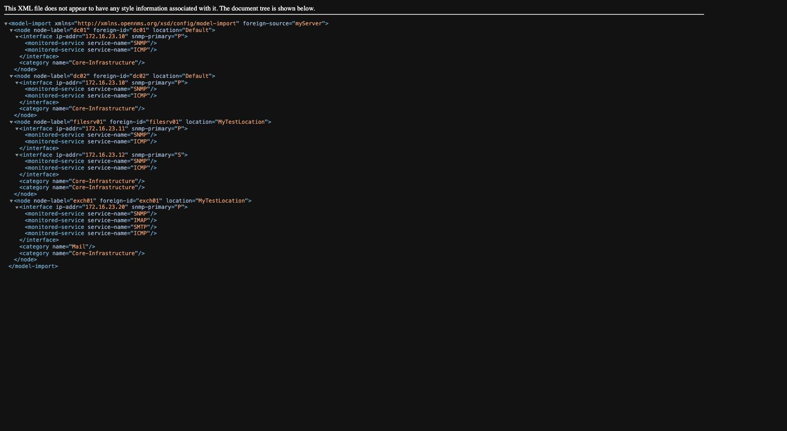
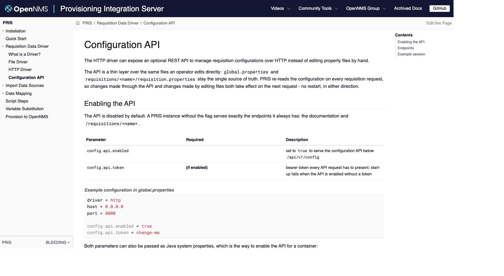

# OpenNMS Provisioning Integration Server (PRIS)

[](https://github.com/OpenNMS/opennms-provisioning-integration-server/actions/workflows/ci.yml)
[](https://github.com/OpenNMS/opennms-provisioning-integration-server/releases)
[](https://hub.docker.com/r/opennms/pris)
[](https://adoptium.net/)
[](LICENSE)

PRIS gets external information from your inventory into an OpenNMS requisition
model. It serves the result as XML over HTTP so OpenNMS Provisiond can import
and discover nodes from it, and lets you normalize, clean up and manipulate the
inventory data before it reaches OpenNMS.

| The documentation served at `/` | A requisition served at `/requisitions/<name>` |
| --- | --- |
|  |  |

## Contents

- [Deployment options](#deployment-options)
  - [Container](#container)
  - [Docker Compose](#docker-compose)
  - [Standalone](#standalone)
  - [From source](#from-source)
- [Configuration](#configuration)
  - [Property files](#property-files)
  - [Configuration REST API (optional)](#configuration-rest-api-optional)
- [Design decisions](#design-decisions)
- [Documentation](#documentation)
- [Build from source](#build-from-source)
- [Build a container image locally](#build-a-container-image-locally)
- [Project layout](#project-layout)
- [Contributing and releasing](#contributing-and-releasing)
- [Project information](#project-information)
- [License](#license)

## Deployment options

All deployment options run the same code and read the same configuration
files; pick whichever fits your environment. Every option below is a working
quick start.

### Container

Released images are published to [Docker Hub]. Start the latest stable
release with:

```sh
docker run --name mypris --detach --publish 8000:8000 opennms/pris:latest
```

Then open <http://localhost:8000>. The two example requisitions are served at
<http://localhost:8000/requisitions/myServer> and
<http://localhost:8000/requisitions/myRouter>.

Image tags:

- `latest` — floating tag tracking the most recent stable release
- `<version>` — a specific release (see the [Docker Hub repository][Docker Hub] for available tags)

To also enable the optional [configuration REST API](#configuration-rest-api-optional),
pass the two system properties (the image entrypoint is plain `java`, so the
full command is repeated):

```sh
docker run --name mypris --detach --publish 8000:8000 opennms/pris:latest \
    -Dconfig.api.enabled=true -Dconfig.api.token=change-me \
    -cp '/opt/opennms-pris/lib/*:/opt/opennms-pris/opennms-pris.jar' org.opennms.pris.Starter
```

### Docker Compose

```yaml
volumes:
  pris.data:
    driver: local

services:
  pris:
    container_name: opennms.pris
    image: opennms/pris:latest
    environment:
      - TZ=Europe/Berlin
    volumes:
      - pris.data:/opt/opennms-pris/requisitions
      - pris.data:/opt/opennms-pris/scriptsteps
    healthcheck:
      test: ["CMD", "curl", "-f", "-I", "http://localhost:8000/index.html"]
      interval: 30s
      timeout: 5s
      retries: 1
    ports:
      - "8000:8000"
```

Data source configuration is persisted to the named volume; mount a local
volume instead if you want to manage scripts and requisition sources from your
host. Configuration changes on the volume take effect on the next request —
no container restart needed.

To enable remote JMX monitoring, pass the options via `JAVA_OPTS`, using your
Docker host IP for `java.rmi.server.hostname` and exposing both RMI ports:

```yaml
environment:
  - JAVA_OPTS=-Dcom.sun.management.jmxremote -Dcom.sun.management.jmxremote.ssl=false -Dcom.sun.management.jmxremote.authenticate=false -Dcom.sun.management.jmxremote.port=19110 -Dcom.sun.management.jmxremote.rmi.port=19111 -Dcom.sun.management.jmxremote.local.only=false -Djava.rmi.server.hostname=<my-docker-host-ip>
ports:
  - "19110:19110"
  - "19111:19111"
```

### Standalone

Download a release archive from the [releases page][GitHub Releases], extract
it and start the server from its directory — the only requirement is a
Java 17 runtime:

```sh
tar -xzf opennms-pris-release-archive.tar.gz
cd opennms-pris
java -cp './lib/*:./opennms-pris.jar' org.opennms.pris.Starter
```

The server configuration lives in `global.properties` next to the jar, the
requisition configurations in the `requisitions/` folder. `opennms-pris.init`
and `opennms-pris.service` templates for SysV and systemd are included in the
archive.

### From source

```sh
git clone https://github.com/OpenNMS/opennms-provisioning-integration-server.git
cd opennms-provisioning-integration-server
make run
```

`make run` builds the project and starts PRIS in the foreground on
<http://localhost:8000>.

## Configuration

### Property files

PRIS is configured through plain property files, and those files are always
the source of truth:

- `global.properties` — the server itself: driver (`http` or `file`), listen
  address and port
- `requisitions/<name>/requisition.properties` — one folder per requisition,
  declaring its data `source` (xls, csv, jdbc, http, ocs, script, …), its
  `mapper` and their parameters

Configuration is re-read on every request, so edits take effect immediately.
The full reference lives in the [documentation][Documentation].

### Configuration REST API (optional)

For managing requisition configurations from tooling — for example a
configuration UI inside OpenNMS — PRIS can expose a REST API below
`/api/v1/config`. It is **disabled by default** and guarded by a bearer
token:

```properties
# global.properties
config.api.enabled = true
config.api.token = change-me
```

```sh
# Create a requisition backed by the XLS source ...
curl -X PUT -H "Authorization: Bearer change-me" \
    -d '{"source": "xls", "source.file": "../myInventory.xls", "mapper": "echo"}' \
    http://localhost:8000/api/v1/config/requisitions/myServer

# ... and it is served immediately, no restart needed
curl http://localhost:8000/requisitions/myServer
```

The API writes the same property files an operator edits by hand, so both
editing paths can be mixed freely. See the [Configuration API page][Config API docs]
of the documentation (also shipped with every PRIS instance) for the endpoint
reference:



## Design decisions

- **Property files stay the single source of truth.** The configuration API is
  a thin CRUD layer over `global.properties` and
  `requisitions/<name>/requisition.properties`. There is no database and no
  hidden state: what is on disk is the configuration, whether it was written
  by hand, by configuration management or through the API.
- **The API is opt-in, and worthless without a token.** A PRIS instance
  without `config.api.enabled` serves exactly what it always has — existing
  standalone and container installations upgrade with zero action. Enabling
  the API without setting `config.api.token` refuses to start rather than
  exposing an unauthenticated write endpoint.
- **No reload machinery.** PRIS re-reads the configuration on every
  requisition request. That makes hand edits and API edits equivalent: each is
  visible through the other path on the next request, with no restart and no
  cache to invalidate.
- **Writes are atomic.** The API writes a temporary file and moves it into
  place, so a requisition request served at the same moment never sees a
  half-written configuration.
- **Referenced files are opaque.** XLS workbooks, Groovy script steps and SQL
  statements are referenced from the property files but not managed through
  the API — they remain ordinary files next to the requisition configuration.

## Documentation

Full user and developer documentation is published at
[docs.opennms.com][Documentation] and shipped with every PRIS instance at
<http://localhost:8000>.

## Build from source

Prerequisites (all must be on your `PATH`):

- [OpenJDK] or another JDK 17 (`java`, `javac`)
- Apache [Maven] (`mvn`)
- [git][git-scm] and `make`
- An internet connection to download Maven dependencies
- [Antora] to build the docs (`antora`); alternatively `make docs-docker` builds them in a container

The `Makefile` is the front door for every build task — list them with:

```sh
make help
```

Common targets:

| Target | Description |
| --- | --- |
| `make compile` | Compile and run the test suite |
| `make lint` | Run the Checkstyle static analysis |
| `make package` | Build the runnable jar and the `.tar.gz` / `.zip` release archives in `opennms-pris-dist/target` |
| `make run` | Build from source and start PRIS in the foreground on <http://localhost:8000> |
| `make smoke-test-standalone` | Smoke test the release archive as a standalone installation |
| `make docs` | Build the Antora documentation |
| `make all` | Compile, package and build the docs |
| `make clean` | Remove build artifacts and the local container image |

The quickest way to build and run from source is:

```sh
make run
```

## Build a container image locally

```sh
make oci
```

This packages the release archive (if missing) and builds an image tagged
`pris:$(cat version.txt)` for your host platform. Override the name and tag with
`make oci IMAGE=mypris VERSION=1.2.3`, then run it:

```sh
docker run --name mypris --detach --publish 8000:8000 "pris:$(cat version.txt)"
```

`make smoke-test` runs the container smoke test against that image, covering
both the default configuration and the enabled configuration API.

Multi-arch (amd64/arm64) images are built and published only by the release
workflow — see [RELEASING.md](RELEASING.md).

## Project layout

Maven multi-module project:

| Module | Purpose |
| --- | --- |
| `opennms-pris-api` | Programming interfaces for configuration, mappers and data sources |
| `opennms-pris-model` | The OpenNMS requisition model |
| `opennms-pris-main` | The provisioning integration server itself, including the optional configuration REST API |
| `opennms-pris-plugins` | Data-source plugins: XLS, script, JDBC, OCS Inventory and defaults |
| `opennms-pris-dist` | Assembles the compiled code into a runnable, distributable archive |

User and developer documentation lives under `docs/` and is built with [Antora].

## Contributing and releasing

- CI/CD workflows live in [`.github/workflows`](.github/workflows); every push
  and pull request is linted, built, packaged and smoke tested both standalone
  and as a container.
- The release process (tag-driven, publishing container images and archives) is
  documented in **[RELEASING.md](RELEASING.md)**.

## Project information

- CI/CD system: [GitHub Actions]
- Container images: [Docker Hub]
- Issue and bug tracking: [GitHub Issues]
- Source code: [GitHub]
- Chat: [Mattermost]
- Maintainer: ronny@opennms.org

## License

Distributed under the GNU General Public License v3.0. See [LICENSE](LICENSE) for
the full text.

[GitHub]: https://github.com/OpenNMS/opennms-provisioning-integration-server
[GitHub Releases]: https://github.com/OpenNMS/opennms-provisioning-integration-server/releases
[GitHub Actions]: https://github.com/OpenNMS/opennms-provisioning-integration-server/actions
[Docker Hub]: https://hub.docker.com/r/opennms/pris
[GitHub Issues]: https://github.com/OpenNMS/opennms-provisioning-integration-server/issues
[OpenJDK]: https://openjdk.org/
[Maven]: https://maven.apache.org/
[git-scm]: https://git-scm.com/
[Mattermost]: https://chat.opennms.com/opennms/channels/opennms-discussion
[Documentation]: https://docs.opennms.com
[Config API docs]: https://docs.opennms.com/pris/latest/driver/config-api.html
[Antora]: https://docs.antora.org/antora/latest/install/install-antora/
